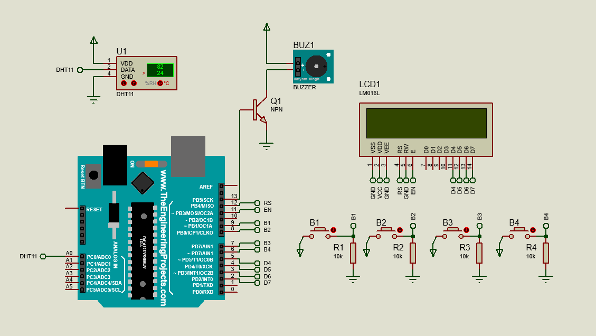

# DigitalAlarmClock-Arduino
Simulation and Circuit Design in Proteus

Press BUTTON1 to switch between 24H and 12H modes.

Long press BUTTON1 to enter clock set up mode.

Long press BUTTON2 to enter alarm set up mode.

Press BUTTON2 to ON/OFF alarm.

Press BUTTON3 for increment a value.

Press BUTTON3 to switch between Fahrenheit and Celcius mode.

Press BUTTON4 to snooze alarm for 5 minutes

